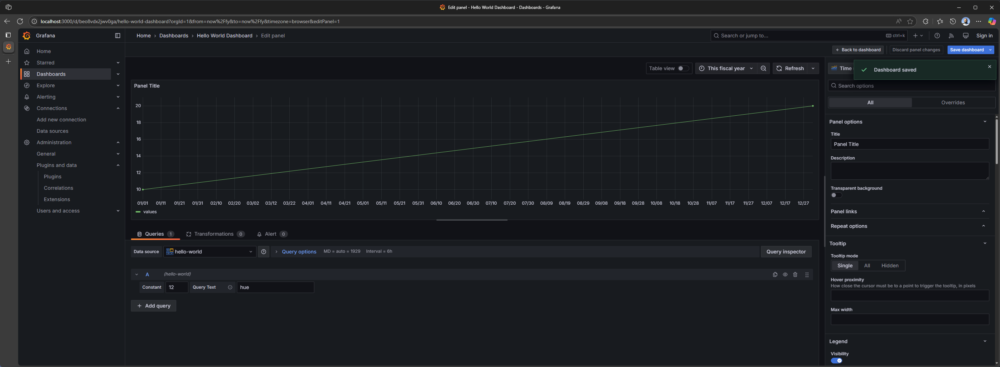

# grafana-playground

Messing around with Grafana.

## How to use, on a Linux machine

1. Get a fresh new WSL machine up:

   ```powershell
   # Delete old WSL
   wsl --unregister Ubuntu-24.04

   # Create new WSL
   wsl --install -d Ubuntu-24.04
   ```

1. Open VS Code in the WSL:

   ```powershell
   code .
   ```

1. Clone the repo, and open VSCode in it:

   ```bash
   cd ~/

   git config --global user.name "Raki Rahman"
   git config --global user.email "mdrakiburrahman@gmail.com"
   git clone https://github.com/mdrakiburrahman/grafana-playground.git

   cd grafana-playground/
   code .
   ```

1. Reset your docker WSL integration since this is a new VM:

   > `Docker Desktop: Settings > Resources > WSL Integration > Turn off/on Ubuntu-24.04`

1. Run the bootstrapper script, that installs all tools idempotently:

   ```bash
   GIT_ROOT=$(git rev-parse --show-toplevel)
   chmod +x ${GIT_ROOT}/.scripts/bootstrap-dev-env.sh && ${GIT_ROOT}/.scripts/bootstrap-dev-env.sh
   ```

## Building and running the plugin

> The tool `npx @grafana/create-plugin@latest` has been run once, and it pulls from [here](https://github.com/grafana/grafana-plugin-examples/tree/main/examples/datasource-basic).

* `cd ./rakirahman-helloworld-datasource`
* `source ~/.bashrc`
* `npm install` to install frontend dependencies.
* `npm run dev` to build the plugin frontend.
* `mage -v build:linux` to build the plugin backend code. Rerun this command every time you edit your backend files.
* `npm run server` to start a grafana development server with docker compose.
* Open `http://localhost:3000` in your browser to create a dashboard to begin developing your plugin.
* `npm run shutdown` to stop a grafana development server with docker compose.

Following [this tutorial](https://grafana.com/developers/plugin-tools/tutorials/build-a-data-source-backend-plugin#create-a-new-plugin), we can create a dummy line chart off our dataset, at [link](http://localhost:3000/d/beo8vdx2jwv0ga/hello-world-dashboard?orgId=1&from=now%2Ffy&to=now%2Ffy&timezone=browser&editPanel=1)

